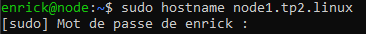

# TP2-linux

## TP2 : Manipulation de services

### Intro

#### Nommer la machine

On change le nom de la machine 

ps -e
ss -lanpt
journal -u

nc -l -p 6668
nc 192.168.56.112

nc -l -p 6668 >> file.txt
nc 192.168.56.112 >> file.txt